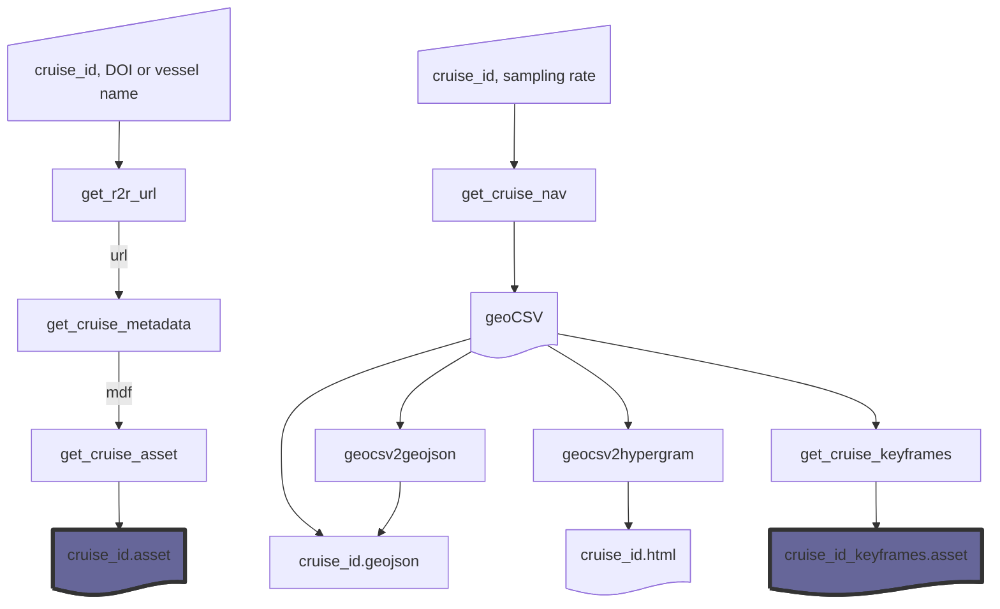

# openspace_rvdata
Ship track plots for [OpenSpace](https://www.openspaceproject.com) pulling data from https://www.rvdata.us.

## Examples
### [RR2402](https://www.rvdata.us/search/cruise/RR2402)

## Software Architecture
The highlighted blocks are OpenSpace assets.

## Acknowledgments
Many thanks to the members of the [OpenSpace Slack](https://openspacesupport.slack.com), particularly [Alex Bock](https://github.com/alexanderbock) (Linköping University), [Micah Acinapura](https://github.com/micahnyc) (American Museum of Natural History) and [James Hedberg](https://github.com/hedbergj) (CCNY Planetarium), who provided guidance and example code. Google Gemini was used to prototype some of the code in this repository. 

## Citations
- A. Bock et al., "OpenSpace: A System for Astrographics," in IEEE Transactions on Visualization and Computer Graphics, vol. 26, no. 1, pp. 633-642, Jan. 2020, doi: 10.1109/TVCG.2019.2934259.
- Rolling Deck to Repository: Supporting the marine science community with data management services from academic research expeditions, Carbotte, S.M., O’Hara, S., Stocks, K., Clark, P., Stolp, L., Smith, S.R., Briggs, K., Hudak, R., Miller, E., Olson, C.J., Shane, N., Uribe, R., Arko, R., Chandler, C.L., Ferrini, V., Miller, S.P., Doyle, A., Holik, J. Frontiers in Marine Science, 9, p.1012756. 2022
- Plotly Technologies Inc. Collaborative data science. Montréal, QC, 2015. https://plot.ly.
